# RadioCalico System Architecture

This document describes the system architecture of the RadioCalico web radio streaming application.

## Architecture Diagram

```mermaid
graph TB
    %% External Services
    subgraph "External Services"
        CDN[CloudFront CDN<br/>📡 d3d4yli4hf5bmh.cloudfront.net]
        HLS_CDN[HLS.js CDN<br/>📦 cdn.jsdelivr.net]
        FONTS[Google Fonts<br/>🔤 fonts.googleapis.com]
    end

    %% User Interface Layer
    subgraph "Client Layer"
        BROWSER[Web Browser<br/>🌐 User Interface]

        subgraph "Frontend Components"
            RADIO_HTML[radio.html<br/>📄 Main Player UI]
            RADIO_JS[radio.js<br/>⚡ Player Logic]
            RADIO_CSS[radio.css<br/>🎨 Styling]
            INDEX_HTML[index.html<br/>📄 Landing Page]
        end
    end

    %% Development Environment
    subgraph "Development Mode"
        DEV_SERVER[Express Server<br/>🔧 Development<br/>Port 3001]
        SQLITE_DEV[(SQLite Database<br/>💾 database.db)]
    end

    %% Production Environment
    subgraph "Production Environment"
        subgraph "Docker Network<br/>radiocalico-network"
            NGINX[Nginx Reverse Proxy<br/>🔀 Port 80<br/>- Static file serving<br/>- API routing<br/>- Security headers<br/>- Gzip compression]

            BACKEND[Express Backend<br/>⚙️ Node.js API<br/>Port 3001<br/>- Rating system<br/>- User management<br/>- Client fingerprinting]

            POSTGRES[(PostgreSQL Database<br/>🗄️ Port 5432<br/>- Users table<br/>- Songs table<br/>- Ratings table)]
        end
    end

    %% CI/CD and Tools
    subgraph "Development Tools"
        GITHUB[GitHub Repository<br/>📦 Source Control]
        ACTIONS[GitHub Actions<br/>🔄 CI/CD Pipeline]
        CLAUDE_BOT[Claude Integration<br/>🤖 Code Review]
        MAKE[Make Targets<br/>⚡ Build Automation]
        DOCKER[Docker<br/>🐳 Containerization]
    end

    %% Security and Monitoring
    subgraph "Security & Performance"
        HELMET[Helmet.js<br/>🛡️ Security Headers]
        CORS[CORS Policy<br/>🔒 Cross-Origin]
        CSP[Content Security Policy<br/>🛡️ XSS Protection]
        PERF[Performance Optimizations<br/>🚀 Lazy loading, Smart polling]
    end

    %% Data Flow - Development
    BROWSER -->|HTTP Requests| DEV_SERVER
    DEV_SERVER -->|Query/Insert| SQLITE_DEV
    DEV_SERVER -->|Static Files| BROWSER

    %% Data Flow - Production
    BROWSER -->|HTTP :80| NGINX
    NGINX -->|Static Assets| BROWSER
    NGINX -->|API Requests /api/*| BACKEND
    BACKEND -->|Database Operations| POSTGRES
    BACKEND -->|JSON Responses| NGINX
    NGINX -->|API Responses| BROWSER

    %% External Dependencies
    BROWSER -->|HLS Stream<br/>Metadata<br/>Album Art| CDN
    BROWSER -->|Library Loading| HLS_CDN
    BROWSER -->|Font Loading| FONTS

    %% Development Workflow
    GITHUB -->|Code Changes| ACTIONS
    ACTIONS -->|Run Tests<br/>Build Images| DOCKER
    ACTIONS -->|Code Analysis| CLAUDE_BOT
    MAKE -->|Automation| DEV_SERVER
    MAKE -->|Production Deploy| NGINX

    %% Security Integration
    BACKEND -.->|Security Middleware| HELMET
    BACKEND -.->|CORS Policy| CORS
    NGINX -.->|CSP Headers| CSP
    RADIO_JS -.->|Optimizations| PERF

    %% Styling
    classDef external fill:#ff9999
    classDef frontend fill:#99ccff
    classDef backend fill:#99ff99
    classDef database fill:#ffcc99
    classDef security fill:#ff99ff
    classDef tools fill:#cccccc

    class CDN,HLS_CDN,FONTS external
    class BROWSER,RADIO_HTML,RADIO_JS,RADIO_CSS,INDEX_HTML frontend
    class DEV_SERVER,BACKEND,NGINX backend
    class SQLITE_DEV,POSTGRES database
    class HELMET,CORS,CSP,PERF security
    class GITHUB,ACTIONS,CLAUDE_BOT,MAKE,DOCKER tools
```



## System Overview

RadioCalico is a web-based radio streaming application with a modern, containerized architecture that supports both development and production environments.

### Architecture Principles

- **Separation of Concerns**: Clear boundaries between frontend, backend, and data layers
- **Environment Parity**: Different configurations for development vs production
- **Security by Design**: Multiple layers of security controls and hardening
- **Performance Optimization**: Lazy loading, caching, and smart resource management
- **Scalability**: Container-based deployment with horizontal scaling capabilities

## Component Details

### Frontend Layer

**Technology Stack:**
- HTML5, CSS3, JavaScript (ES6+)
- HLS.js for adaptive streaming
- Progressive Web App features

**Key Features:**
- **Performance Optimizations**: Lazy loading, font preloading, smart polling
- **Audio Streaming**: HLS adaptive bitrate streaming with fallback support
- **User Interface**: Responsive design with loading states and animations
- **Client Fingerprinting**: Anonymous user identification for rating system

**Files:**
- `public/radio.html` - Main radio player interface
- `public/radio.js` - Player logic and API interactions
- `public/radio.css` - Styling with performance optimizations
- `public/index.html` - Landing page

### Backend Services

**Technology Stack:**
- Node.js with Express.js framework
- SQLite (development) / PostgreSQL (production)
- Security middleware (Helmet.js, CORS)

**API Endpoints:**
- `GET /api/users` - User management
- `POST /api/users` - User creation
- `GET /api/song/:hash/ratings` - Get song ratings
- `POST /api/song/:hash/rate` - Submit rating
- `GET /api/song/:hash/user-rating/:userId` - Get user's rating
- `GET /api/client-ip` - Client IP for fingerprinting

**Key Features:**
- **Rating System**: Thumbs up/down with atomic transactions
- **User Management**: Anonymous fingerprinting and optional registration
- **Security**: CSP headers, input validation, SQL injection prevention
- **Database Abstraction**: Dual-mode support for SQLite/PostgreSQL

### Data Layer

**Development Database (SQLite):**
- File-based storage (`database.db`)
- Zero configuration setup
- ACID compliance with transactions
- Perfect for development and testing

**Production Database (PostgreSQL):**
- Full RDBMS with advanced features
- Connection pooling and performance optimization
- Backup and recovery capabilities
- Horizontal scaling support

**Database Schema:**
```sql
-- Users table
CREATE TABLE users (
    id INTEGER PRIMARY KEY AUTOINCREMENT,
    name TEXT NOT NULL,
    email TEXT UNIQUE NOT NULL,
    created_at DATETIME DEFAULT CURRENT_TIMESTAMP
);

-- Songs table
CREATE TABLE songs (
    id INTEGER PRIMARY KEY AUTOINCREMENT,
    title TEXT NOT NULL,
    artist TEXT NOT NULL,
    album TEXT,
    song_hash TEXT UNIQUE NOT NULL,
    created_at DATETIME DEFAULT CURRENT_TIMESTAMP
);

-- Ratings table
CREATE TABLE ratings (
    id INTEGER PRIMARY KEY AUTOINCREMENT,
    song_id INTEGER NOT NULL,
    user_id TEXT NOT NULL,
    rating INTEGER NOT NULL CHECK (rating IN (-1, 1)),
    created_at DATETIME DEFAULT CURRENT_TIMESTAMP,
    FOREIGN KEY (song_id) REFERENCES songs (id),
    UNIQUE(song_id, user_id)
);
```

### Infrastructure Layer

**Development Environment:**
- Single Express.js server serving both API and static files
- SQLite database for simplicity
- Direct access on port 3001
- Hot reloading and development tools

**Production Environment:**
- **Nginx**: Reverse proxy, static file serving, security headers
- **Express Backend**: API server with security hardening
- **PostgreSQL**: Production database with persistence
- **Docker Compose**: Container orchestration with networking

**Security Features:**
- Container security: read-only filesystems, capability restrictions
- Network isolation with Docker networks
- Security headers: CSP, HSTS, X-Frame-Options
- Input validation and SQL injection prevention

### External Dependencies

**CloudFront CDN (`d3d4yli4hf5bmh.cloudfront.net`):**
- HLS audio streaming (48kHz FLAC)
- Real-time metadata API
- Album art and cover images
- Global CDN distribution

**HLS.js Library (`cdn.jsdelivr.net`):**
- Adaptive bitrate streaming support
- Cross-browser compatibility
- Lazy loaded to improve performance

**Google Fonts (`fonts.googleapis.com`):**
- Web font loading with preload optimization
- Montserrat and Open Sans font families
- Performance optimized with resource hints

## Development Workflow

### Local Development
```bash
# Start development server
npm run dev
# or
make dev

# Run tests
npm test
# or
make test

# Security scan
make security
```

### Production Deployment
```bash
# Build and start production environment
make prod-start

# Or step by step
make prod-build
make prod

# Monitor logs
make prod-logs
```

### CI/CD Pipeline

**GitHub Actions Integration:**
- Automated testing on push/PR
- Security scanning and vulnerability checks
- Docker image building and validation
- Claude integration for code review

**Make Targets:**
- Standardized commands for all operations
- Cross-platform compatibility
- Development, testing, and production workflows
- Security scanning and validation

## Performance Optimizations

### Frontend Performance
- **Lazy Loading**: HLS.js library loads only when needed
- **Smart Polling**: Adaptive metadata refresh based on activity
- **Resource Hints**: Preconnect to external domains
- **Font Optimization**: Preload critical fonts, async loading
- **Image Optimization**: Lazy loading, async decoding, WebP support

### Backend Performance
- **Database Optimization**: Prepared statements, transactions
- **Connection Pooling**: PostgreSQL connection management
- **Caching**: Static asset caching with appropriate headers
- **Compression**: Gzip compression for text assets

### Infrastructure Performance
- **CDN Integration**: Global content delivery
- **Container Optimization**: Minimal image sizes, security hardening
- **Network Optimization**: Docker networking with service discovery

## Security Architecture

### Defense in Depth

1. **Network Security**:
   - Container network isolation
   - Reverse proxy with rate limiting
   - Security headers (CSP, HSTS, etc.)

2. **Application Security**:
   - Input validation and sanitization
   - SQL injection prevention
   - XSS protection with CSP
   - CORS policy enforcement

3. **Container Security**:
   - Non-root user execution
   - Read-only filesystems
   - Capability restrictions
   - Security scanning with Trivy

4. **Data Security**:
   - Anonymous user fingerprinting
   - No sensitive data storage
   - Secure database connections

## Monitoring and Maintenance

### Health Checks
- Container health monitoring
- Database connectivity checks
- API endpoint validation
- Service dependency verification

### Logging
- Structured JSON logging
- Log rotation and retention
- Security event logging
- Performance metrics

### Backup and Recovery
- Database backup automation
- Container image versioning
- Configuration management
- Disaster recovery procedures

## Deployment Environments

### Development
- **Purpose**: Local development and testing
- **Database**: SQLite (file-based)
- **Server**: Single Express.js instance
- **Port**: 3001
- **Features**: Hot reloading, debug logging, test data

### Production
- **Purpose**: Live radio streaming service
- **Database**: PostgreSQL (containerized)
- **Architecture**: Microservices (Nginx + Express + PostgreSQL)
- **Port**: 80 (HTTP)
- **Features**: Security hardening, performance optimization, monitoring

## Scaling Considerations

### Horizontal Scaling
- Load balancer in front of multiple Nginx instances
- Multiple backend API servers with shared database
- Database read replicas for improved read performance
- CDN integration for global content delivery

### Vertical Scaling
- Container resource allocation optimization
- Database performance tuning
- Memory and CPU optimization
- Storage optimization

## Technology Choices

### Why Node.js/Express?
- JavaScript ecosystem consistency
- Excellent streaming capabilities
- Rich middleware ecosystem
- Good Docker container support

### Why SQLite + PostgreSQL?
- Development simplicity with SQLite
- Production robustness with PostgreSQL
- Easy migration path between environments
- SQL standardization

### Why Docker?
- Environment consistency
- Easy deployment and scaling
- Security isolation
- Infrastructure as code

### Why Nginx?
- High-performance static file serving
- Excellent reverse proxy capabilities
- Security header support
- Proven at scale

This architecture provides a solid foundation for a production-ready web radio streaming application with room for growth and enhancement.